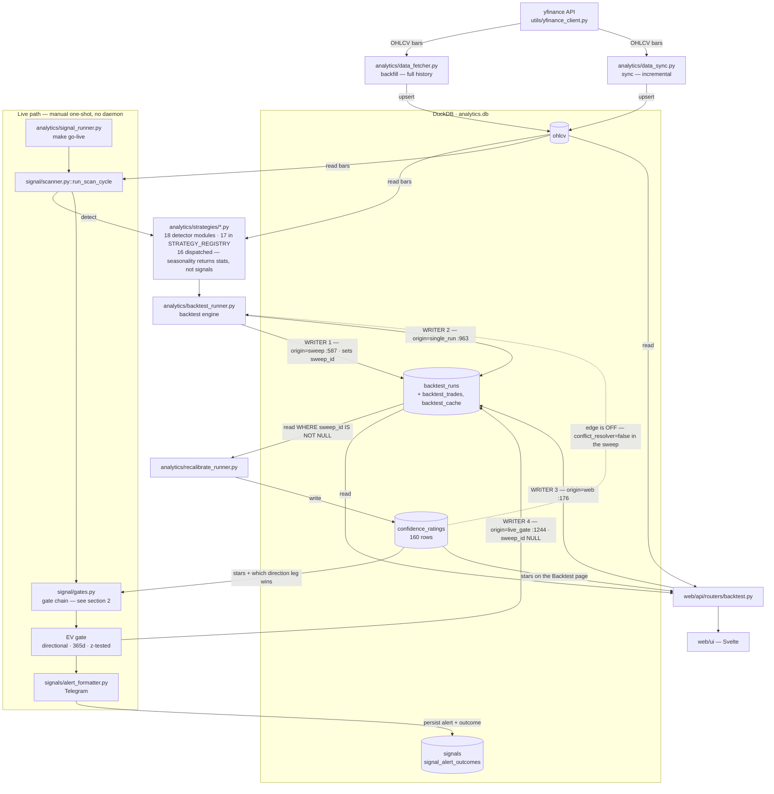

# Buibui Wifey Wall Street Bot — System Overview

**Purpose.** Provide a self-contained mental model of the live signal pipeline so an outside reviewer (ChatGPT, Gemini, a trading-savvy friend) can assess: *given the current architecture, what is missing for this system to be measurably profitable?*

**Audience.**

1. The maintainer — to keep a coherent mental model across long-running development.
2. External LLM reviewers — see [§9 External-AI briefing prompt](#9-external-ai-briefing-prompt) for the self-contained copy-paste.

**Last updated.** **2026-08-13 — every section rewritten and verified against the tree.**
§1 in PR #173; §§2–9 here, replacing content inherited from the crypto parent
`buibui-moon-trader-bot` that had survived four post-fork commits (8 added lines total)
without a substantive revision.

> **Reading rules for the numbers below.** Every figure in §4 was queried from
> `analytics.db` on **2026-08-13**, with §4a re-run **2026-08-14** after #195 corrected the
> ledger, and each carries the query that reproduces it. Two dating
> rules apply to anything quoted from elsewhere: a number measured **before 2026-08-07**
> is on the **ungated** population (~33–35% more trades), and a rating measured **before
> 2026-08-13** is **symbol-unweighted** (#172). `CLAUDE.md` remains authoritative for
> sleeve verdicts and footguns; this doc is the mental model, not the source of truth.

**Live state in one line** (2026-08-13): 18 detector modules, 16 dispatched; six research
sleeves all non-positive and the TA detector book frozen; no equity-native edge established;
dispatch is a manual one-shot (`make go-live`), not a daemon.

---

## Table of contents

1. [System architecture (data flow)](#1-system-architecture-data-flow)
2. [Active gate chain (ordered)](#2-active-gate-chain-ordered)
3. [Strategy inventory (live state)](#3-strategy-inventory-live-state)
4. [Current measured edge](#4-current-measured-edge)
5. [Known issues & open hypotheses](#5-known-issues--open-hypotheses)
6. [Profitability gaps](#6-profitability-gaps)
7. [Tooling & evidence trail](#7-tooling--evidence-trail)
8. [Open questions](#8-open-questions)
9. [External-AI briefing prompt](#9-external-ai-briefing-prompt)

---

## 1. System architecture (data flow)

**Verified against the tree at `5bf695d` (2026-08-13).** Every edge is directed:
`A --> B` means A writes to, or hands off to, B. Read the two callouts under the
diagram before drawing any conclusion from it — both encode defects this repo has
already paid for.



**`backtest_runs` has FOUR writers, and the writer is part of the row key**
(`origin`, PR #148). A row-key derived from parameters alone does not identify a
measurement: before #148 the live gate's single-strategy row *replaced* the
competed sweep row in place. Never read `backtest_runs` without saying which
`origin` you mean — `sweep` (the only one `recalibrate` consumes) and `live_gate`
are different populations measured over different windows.

**The dashed edge is the one that decides whether a change needs a full
`make db-update`.** `confidence_ratings` is a **leaf** only because
`conflict_resolver` is off inside the sweep (`backtest_runner.py:211` returns
`None`, so the sweep never reads ratings). Switching it on closes a loop — sweep
resolves ties from ratings, which changes `backtest_runs`, which changes the next
recalibrate — and it measurably does not converge (PR #149). While the edge stays
dashed, a ratings-only fix needs `make db-update-recalibrate`, not the full chain.
**The live path always resolves conflicts** (`scanner.py:571`, ungated), which is
why a rating change is operational and not cosmetic.

**CLI surface** (single entry `wifey.py`, verified against `wifey --help`):

- `wifey analytics backfill | sync` — ingestion
- `wifey signal watch` — live daemon (**no wifey daemon or timer is installed**;
  dispatch is the manual one-shot `make go-live`)
- `wifey signal test` — historical replay (no DB writes)
- `wifey backtest` — manual + sweep + combo + cross-TF modes
- `wifey digest` — pre-canned analytics queries
- `wifey param-audit | param-sweep` — WFO Phase 1 + Phase 2
- `wifey recalibrate` — refresh star ratings
- `wifey web` — start FastAPI

**Detection lives in `analytics/strategies/<name>.py`**. The `signals/` package only handles alert dispatch + dedup. The split is deliberate: detection is testable and reusable across live + replay + backtest; alerting is side-effectful and lives behind a thin facade.

---

## 2. Active gate chain (ordered)

Production ordering inside `run_scan_cycle` (`analytics/signal/scanner.py`, Phase 3), read
off the code 2026-08-13. Every alert that reaches Telegram has survived **all** of these.

| # | Gate | Mode | What it does | Where |
| --- | --- | --- | --- | --- |
| **Pre** | OHLCV fetch + regime / HTF-EMA caches | — | Phase 1, per-cycle (not per-symbol), so a cycle is internally consistent. Cache miss **falls open**. | `scanner.py` Phase 1 |
| **Detect** | `detect_<strategy>` | — | Phase 2 fan-out per (symbol, tf). | `analytics/strategies/*.py` |
| 0 | ATR-as-min-SL floor | Per-cell opt-in | Widens `sl_price` to `max(structural, atr_mult × ATR14)`, recomputes TP to hold R:R. Runs first so every downstream gate sees final levels. | `:557` |
| 1 | **Conflict resolution** | **Always on** | Drops the losing side when long+short fire on the same (symbol, tf, candle). Picks by star rating — this is why a ratings change is operational. **Ungated on the live path**, deliberately off in the sweep (#149). | `:571` |
| 2 | Candle watermark / cooldown | Always on | Per-(symbol, strategy) watermark plus `CooldownStore`. Cold-start restricts to the latest candle. | `:575` |
| 3 | **EV gate** | **HARD** | Looks up the just-computed backtest for this (symbol, strategy, tf, **direction**) and blocks when directional `avg_r` is ≥ `min_avg_r_z` (1.64) standard errors below `min_avg_r` (0.0), over a 365d window, counting **directional** trades against `min_trades`. | `:749` |
| 4 | Volume gate | Per-strategy opt-in | `volume_suppress` drops low-volume candles; a >3× spike bypasses suppression when `volume_spike_boost` is on. Spike is **always** tagged for the ⚡ in the alert. | `:763` |
| 5 | Bias: regime | **SOFT** | Drops signals whose strategy type is not enabled for the current 4h regime. | `:847` |
| 6 | Bias: direction filter | SOFT | Per-strategy `suppress_long` / `suppress_short`. **Wired and enabled with nothing to act on** — no strategy sets either flag since #143 removed `bos.suppress_long`. | `:861` |
| 7 | Bias: F8 HTF EMA | **HARD** | Drops signals against the HTF EMA-50 slope. 0.3% deadband lets HTF chop through. | `:874` |
| 8 | Bias: ADR directional suppress | Soft suppress | When consumed ADR ≥ threshold, drops signals *chasing* the day's move. `adr_exempt` bypasses. Live context is **1h-derived**, so it does not hit the `1d`/`1wk` degeneracy that #142 fixed on the backtest side. | `:886` |
| 9 | Bias: DOW soft suppress | Soft | Costs **1 star** (never drops) when direction opposes the day's historical drift. | `:930` |
| 10 | Co-fire confluence | Tag-only | Appends a confluence blockquote. **Currently inert — both combo tables hold 0 rows** (§4). | `:1090` |
| 11 | Telegram dispatch + persist | — | One alert per surviving signal; watermark advances only after a successful send. | `:1181` |

**Three things the ordering itself tells you.**

- **The EV gate runs at step 3, before the volume and bias gates** — earlier than the crypto-era
  design (which placed it last). So a signal can be blocked on backtest evidence it would never
  have generated post-bias, and the confluence tag at step 10 can never rescue it.
- **Only the EV gate uses evidence**; every other gate is rule logic.
- **Regime decides whether a strategy type fires at all; F8 decides direction.** Both are
  read from per-cycle caches that fail open.

---

## 3. Strategy inventory (live state)

Source: `config/signal_watch.toml` × `analytics/strategies/_registry.py`, read 2026-08-13.

**Three registry counts, all correct, all different** — quote the one you mean:

| Count | Value | Meaning |
| --- | --- | --- |
| Detector modules | **18** | files under `analytics/strategies/` defining a top-level `detect_*` |
| `STRATEGY_REGISTRY` | **17** | known strategies |
| `DETECTOR_REGISTRY` | **16** | actually dispatched — `seasonality` is excluded because it returns stats, not signals |

Unregistered modules: `fibonacci_retracement` (retired) and `funding_extreme` (crypto-only —
funding rates do not exist for equities; the file survives the fork, the strategy does not).

**Both live configs enable the same 12 strategies**: `orb`, `bos`, `eqh_eql`, `order_block`,
`trend_day`, `engulfing`, `pin_bar`, `inside_bar`, `hammer_hanging_man`, `doji`,
`morning_evening_star`, `ema`. They differ only in day filter, timeframes, and per-strategy
timeframe overrides:

| Config | Day filter | Timeframes | Overrides | Declared cells | Runs live? |
| --- | --- | --- | --- | --- | --- |
| `signal_watch.toml` | `tue_thu` | `4h`, `1d` | `bos → 1d`, `orb → 4h` | **22** | **yes** |
| `signal_watch_weekdays.toml` | `weekdays` | `4h`, `1d`, `1wk` | `ema → 4h,1d`; `eqh_eql → 4h,1d`; `orb → 4h` | **32** | no |

`signal_watch`'s 22 cells are a **strict subset** of `weekdays`' 32, so the two are not
independent samples — never pool them. Both `extends = "strategy_params.toml"`, the shared base
that owns the five live-parity gates and any flag whose correctness depends on a second flag.

**Two universes, deliberately different sizes**: `config/stocks.json` is the gitignored
**13-symbol** live watchlist (AAPL, ADBE, AMD, AMZN, GOOGL, META, MSFT, MSTR, NVDA, ORCL, QQQ,
SPY, TSLA); `config/universe.json` is the committed **505-member** research breadth universe.
A ledger symbol outside the 13 goes stale — `make go-live` syncs the watchlist only.

**The TA detector book is FROZEN**: no new detectors, no `tp_r` / gate / threshold sweeps.

---

## 4. Current measured edge

All figures below were queried from `analytics.db` on **2026-08-13** (§4a re-run **2026-08-14**) and are reproducible with
the query named in each row.

### 4a. Live alert ledger — the only record of real dispatched signals

`signal_alert_outcomes`, **298 rows**, 13 symbols, **2026-06-04 → 2026-08-12** (UTC, by
`fired_at_ms`).

| Outcome | n | avg R |
| --- | --- | --- |
| loss | 198 | −1.000 |
| win | 45 | +2.844 |
| expired | 24 | +0.967 |
| still open | 31 | — |
| **resolved total** | **267** | **−0.1752** |

**The live book is net negative at −0.175R per resolved alert**, on an 18.5% strike rate
(45 of 243 decided). The payoff structure is working as designed — winners average +2.8R
against −1.0R losers — but the hit rate does not pay for it.

**Both figures moved on 2026-08-14 (#195) and the old ones are a staleness tell.** The
ledger had credited each win the *declared* `tp_r` rather than the target the resolver
actually walked, so the win row read +3.144 and the total −0.1247. `migrations/003_*`
corrected 8 wins (+13.50R of phantom credit). Re-run the query below rather than trusting
either number.

Read it with three caveats. **282 of 298 rows are pre-#151**, i.e. they fired before the EV
gate was direction-counted and significance-tested; the 31 open rows are correctly open
(the hold window is in **bars**, not days); and the whole sample is one bull-market quarter
on 13 megacaps, so a long-tilted book flatters itself.

```sql
SELECT outcome, COUNT(*), ROUND(AVG(outcome_r),3) FROM signal_alert_outcomes GROUP BY 1;
```

Worst and best cells by realized R (n ≥ 13): `trend_day 1d` −0.405 (n=31), `inside_bar 4h`
−0.333 (n=24), `trend_day 4h` −0.217 (n=68 — the largest single cell), against
`morning_evening_star 1d` +0.447 (n=19) and `pin_bar 4h` +0.231 (n=13). No cell reaches the
n=30 needed per direction to be worth acting on alone.

### 4b. Star ratings

`confidence_ratings`, **160 rows** (66 `signal_watch` + 94 `weekdays`), rebuilt by
`make db-update-recalibrate`. Ratings are **sweep-only** (`sweep_id IS NOT NULL`),
**declared-only**, **writer-keyed**, and since #172 pooled over **trades**, not symbols.

| Config | rows | mean stars | rows with `avg_r > 0` |
| --- | --- | --- | --- |
| `signal_watch` | 66 | 2.06 | 39 (59%) |
| `signal_watch_weekdays` | 94 | 1.57 | 36 (38%) |

`backtest_runs` holds **3,166** sweep rows plus **102** `origin="live_gate"` rows; the two are
separate populations sharing a table, which is exactly why the writer is part of the row key.

### 4c. Confluence — wired but inert

**`backtest_combos` and `backtest_cross_tf_combos` both hold 0 rows.** The co-fire gate at
step 10 reads them, so **no alert can currently carry a confluence tag**. This is not market
sparsity (the crypto-era reading); it is an empty table. Populating it means running
`make wifey-combo-backtest` / `wifey-cross-tf-backtest` — which is a *sweep*, and sweeps are
frozen. Left inert on purpose; the gate is tag-only, so nothing downstream breaks.

### 4d. Research sleeves — six built, six non-positive

Full verdicts and the gate each failed live in `CLAUDE.md → Sleeve verdicts`; the one-line
summary is that the free-data edge-hunt arc is **concluded**, `forecast` and `xsmom` fail
pre-cost, and `lowvol` / `pead` failed their own neutrality guardrails, so neither is even
evidence about the underlying premium. **Do not rebuild a shelved sleeve.**

### 4e. Data coverage — history is not uniform

| TF | rows | from | to |
| --- | --- | --- | --- |
| `1d` | 1,128,528 | 2007-03-01 | 2026-08-11 |
| `1wk` | 219,773 | 2018-01-01 | 2026-08-03 |
| `4h` | 105,604 | **2024-05-16** | 2026-08-11 |
| `1h` | 73,348 | **2024-06-04** | 2026-08-11 |

**Any `4h` or `1h` claim is bounded at ~2.2 years**, and `4h` on US RTH is **2 bars/day**, not
the 6 a crypto-era constant assumes. Live scans run `4h` and `1d` only.

---

## 5. Known issues & open hypotheses

1. **No equity-native edge is established.** This is the binding constraint, and it is
   endogenous — eight sleeves are non-positive and the live ledger is −0.175R. Sizing, portfolio
   construction and the order layer are all downstream of an edge that does not yet exist.
2. **The EV gate sits upstream of the recorder.** A blocked leg is dropped before
   `signal_alert_outcomes` is written, so suppression destroys evidence rather than merely
   withholding an alert. This is why the gate's rule was moved to a significance test (#151)
   rather than made stricter.
3. **Confluence is inert** (§4c) — the tables are empty, so a documented gate contributes
   nothing today.
4. **The direction filter has nothing to act on** — enabled, wired, and no strategy sets a
   flag since #143 re-derived the inherited `bos.suppress_long` and found the sign **inverts**
   on equities.
5. **`conflict_resolver` must stay off in the sweep.** It reads `confidence_ratings`, which the
   sweep produces, so enabling it there is a fixed-point iteration, measured at 108 → 66 rows
   differing across three passes — damping but not converged (#149).
6. **Exits are fixable at the cohort level, not per-edge.** Of the 157 losses that could show
   excursion, 43.9% reached ≥1R before stopping (n=264). No individual loss cell reaches n=30.
7. **`1wk` is structurally thin** — `min_trades_1wk` is 1, so its gate is nearly always
   permissive; treat any `1wk` rating as provisional.
8. **No daemon exists.** Dispatch is a manual one-shot (`make go-live`), operator-only. Run it
   **pre-open**: `1d` bars stamp 04:00/05:00 UTC and close the *next* day, so at the bell the
   session's daily bar is still forming.

---

## 6. Profitability gaps

Phase A is signals-only, so these are the gaps between *the bot emits signals* and *the bot
could make money*. Ordered by what blocks what.

| Gap | Current state | What it blocks |
| --- | --- | --- |
| **An actual edge** | Eight sleeves non-positive; live ledger −0.175R over 267 resolved alerts. | Everything. You cannot vol-target or size your way out of a negative expectancy. |
| **Outcome ledger depth** | 298 rows, **282 pre-#151**, 0 of 30 loss cells at n=30. | Per-cell decisions. The ledger exists and resolves correctly — it is simply young. |
| **Position sizing** | None. Phase A emits levels, not size. | Turning a positive cell into PnL. Deferred until an edge clears gate G1. |
| **Order layer / broker** | `trade/` is an empty placeholder — both files 0 bytes; the parent's Binance opener was dropped at fork and nothing replaced it. | Execution. **Phase B, gated G3→G4.** |
| **Off-site backup** | `make backup` is verified but **local-only**; `docs/plans/` is single-copy and gitignored. | Survival of the research record. A provider decision, not a build. |

---

## 7. Tooling & evidence trail

| Command | Purpose |
| --- | --- |
| `make db-update` | The routine refresh: backtest (**both** configs) → recalibrate → regression goldens → dead-surface check. The completion banner is **conditional** on the last step. |
| `make db-update-recalibrate` | Ratings only. Sufficient when a change cannot feed back into the sweep — verify the data-flow direction first (#172). |
| `make check-dead-surfaces` | Reports cells where declaration and output disagree **in either direction**. Cannot see a partial haircut, only exact zeros. |
| `make docs-index` / `docs-index-check` | Regenerate / verify the generated `INDEX.md` files. Never hand-edit either. |
| `make backup` / `backup-dry-run` | Verified local snapshot of `analytics.db` + the whole gitignored `docs/plans/` tree. |
| `make go-live` | The manual one-shot dispatch. **Operator-only — Telegram goes out.** |
| `wifey backtest` / `param-audit` / `param-sweep` | Backtest and WFO surfaces. **Frozen** for `tp_r` / gate / threshold work. |
| `tools/combo_health.py` | Spot-check the combo tables (currently empty — §4c). |
| `tools/regime_gate_replay.py`, `direction_filter_replay.py` | Join `backtest_trades` against a gate to label trades suppressed/kept. Both still work; both last produced **crypto-era** verdicts that #143 re-derived and inverted. |
| `docs/plans/scripts/*.py` | Gitignored, durable measurement scripts. The convention: **call production functions**, and assert the replication reproduces production output before comparing. |

**Three `min_trades` surfaces disagree by 2–5×** — live EV 12/5/2/1, sweep 20/10/5/2,
recalibrate combined 10 / directional 5. Always name the surface.

---

## 8. Open questions

The live list is `memory/project_open_questions.md`; these are the ones an outside reviewer is
best placed to challenge.

1. **Is a free-data equity edge findable at all, or is the honest conclusion that the data is
   the constraint?** Four hunts were run and closed. Reopening needs an explicit decision, not
   drift.
2. ~~**Should the exit policy be A/B'd** (build #437)?~~ **ANSWERED — built 2026-08-14 (PR #194).**
   The design blocker dissolved on contact: the engine imports no `portfolio/`, so only the verdict
   layer needed substituting (per-trade R Sharpe + a paired bootstrap). Verdict **BOUNDED**: the
   paired uplift is real and survives multiplicity, but it certifies "A beats B" and no arm's own
   mean R clears zero. The live question it replaces: **the lever is the holding period, so is the
   actionable change an exit policy at all, or a shorter declared hold?** See
   `docs/audits/2026-08-14-exit-policy-ab-v1.md`.
3. **Is the 13-symbol megacap watchlist the right live universe** when the research universe is
   505 names? A significant cell on 13 correlated megacaps in a bull market must still pass a
   beta test before it counts as alpha.
4. **Is the TA book worth unfreezing** given the ledger, or is the freeze the correct terminal
   state for that category?
5. **Should confluence be repopulated** (§4c), given it requires running a frozen sweep?

---

## 9. External-AI briefing prompt

> **Copy from here to the end and paste into ChatGPT / Gemini / Claude.ai for an outside read.**
> Rewritten for this repo 2026-08-13 — the previous version described the crypto parent.

```text
I'm building a US-equities signal bot (Phase A: signals only, no order execution).
Data is free yfinance OHLCV. It watches 13 megacap symbols (AAPL, ADBE, AMD, AMZN,
GOOGL, META, MSFT, MSTR, NVDA, ORCL, QQQ, SPY, TSLA) on 4h and 1d bars, with a
505-name research universe used for breadth studies. Stack: Python 3.11, DuckDB,
FastAPI + Svelte UI. Dispatch is a manual one-shot to Telegram; there is no daemon.

What exists:

- 18 candlestick/structural detector modules, 16 dispatched (bos, orb, eqh_eql,
  order_block, trend_day, engulfing, pin_bar, inside_bar, hammer_hanging_man, doji,
  morning_evening_star, ema and others). Classic TA — no orderflow, no fundamentals.
- An 11-step live gate chain: ATR-SL floor -> conflict resolution -> candle
  watermark/cooldown -> a hard expected-value gate driven by backtest evidence ->
  volume -> regime -> direction filter -> higher-timeframe EMA slope (hard) ->
  average-daily-range exhaustion -> day-of-week soft suppress -> confluence tag.
- A backtest engine with walk-forward parameter tooling, star ratings recalculated
  from accumulated backtest runs, and a live alert ledger that resolves each
  dispatched signal to win/loss/expired.
- Research guards: deflated Sharpe, PBO, bootstrap confidence intervals. A sleeve
  must clear DSR>=0.95, PBO<=0.5, bootstrap lower bound >0, and Sharpe>=0.7 net of
  cost to be considered real.

What the measurements say:

- The live ledger is 298 alerts over ~10 weeks, 267 resolved, averaging -0.175R.
  Strike rate 18.5%; winners average +2.84R, losers -1.0R. So the payoff shape is
  fine and the hit rate is not.
- Six research sleeves have been built and measured, and ALL are non-positive:
  EWMAC trend following (portfolio Sharpe -0.05, negative even before costs),
  cross-sectional momentum (-0.156 at 2bps), residualised cross-sectional momentum
  (+0.15, fails DSR), low-beta/BAB (-0.069, and its beta-neutrality guardrail
  fired), cross-asset time-series momentum (+0.36 at 2bps, clean but too weak),
  and post-earnings-announcement drift (+0.10, beta guardrail fired).
- The TA detector book is frozen: no new detectors and no threshold sweeps, on the
  grounds that the category has repeatedly produced negative expectancy.

My question: given this architecture and these results, what is actually missing for
this system to be measurably profitable? I am specifically interested in whether the
honest answer is "free daily OHLCV on 13 megacaps cannot support an edge, change the
data or the universe" versus "the edge is there and the construction is wrong". If
the latter, what construction would you test first, and what would falsify it?

Constraints worth knowing: no paid data feed, no order execution yet, and a hard
rule that any candidate must clear the four research guards above out-of-sample
before it is deployed.
```

---

## Doc maintenance

- Update **§2** when the gate chain changes — a gate added, removed, reordered, or its mode
  flipped. The line numbers are part of the claim; re-read them, do not assume they held.
- Update **§3** when a strategy is added or removed, a config's `strategy_timeframes` changes,
  or either registry count moves.
- Update **§4** after any `make db-update`. **Re-run the queries; never edit a number in
  place** — each table states the query that produces it, which is the only thing making the
  figure falsifiable.
- Update **§5/§6** when an issue closes or a gap is filled, and **§9** whenever §3 or §4 moves
  enough that the briefing would mislead an outside reader.
- **Date every number you add**, and say which population it is on (see the reading rules at
  the top). An undated figure here becomes a crypto-era artifact within one fork.

The file is intentionally self-contained — no internal `[[link]]`s. The audience includes external LLMs that won't have the repo loaded.
